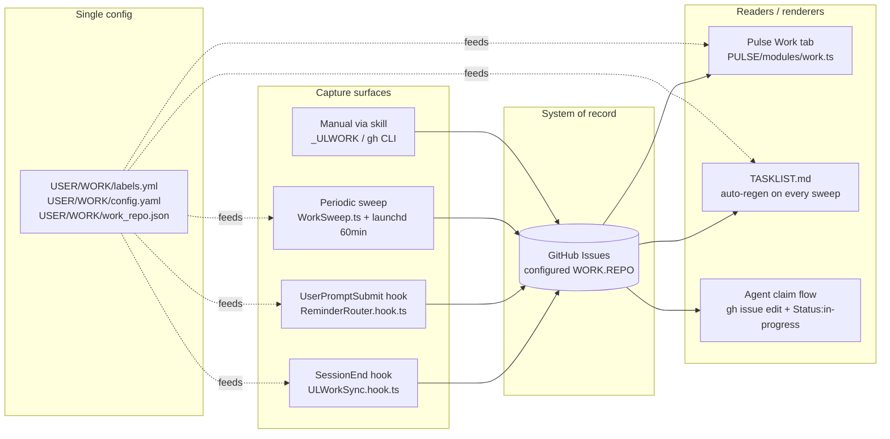

# Work System

> The Work System is the hill-climb's ledger (`LIFEOS/DOCUMENTATION/LifeOs/LifeOsThesis.md`). Every captured unit of work is a step taken toward ideal state, and the TELOS sweep is the loop closing on itself: an active goal with no open issue is a declared ideal state with no next move — exactly the gap the OS exists to surface.

> The Work System turns every meaningful unit of work the principal does — Algorithm sessions, NATIVE work that touched files, explicit reminders, periodic check-ins on stale projects, TELOS goals without a next action — into a labeled GitHub issue in one configured private repo. The repo is the system of record. The Pulse Work tab, the auto-regenerated TASKLIST.md, and the agent claim flow are all readers.

## Why this exists

LifeOS does a lot of work. Before this redesign (2026-05-25), one out of 208 sessions in a month had landed in the work repo — a 0.5% capture rate. The principal's "system of record for all work" was structurally empty. Three independent failures combined: (a) the SessionEnd hook skipped NATIVE-mode sessions and most prompts now classify as NATIVE, (b) the hook wrote `Type:*`/`Status:*` prefixed labels that didn't exist in the repo so issues landed naked, (c) the hand-maintained TASKLIST.md hadn't been updated in five weeks. Capture was almost zero, render was wrong, the unified view was stale.

The redesign closes all three loops at once and adds a fourth capture surface — a periodic sweep that catches what event-driven hooks miss.

## Architecture



Every surface reads `WORK.REPO`, the kanban columns, and the project→property map from a single `USER/WORK/` config tree via `hooks/lib/work-config.ts`. Zero principal-specific identifiers live in SYSTEM code — point a different `work_repo.json` at a different private repo and the entire system pivots.

## Capture surfaces (in priority order)

### 1. SessionEnd hook — `hooks/ULWorkSync.hook.ts`

> **Private component — NOT in the public release payload.** `hooks/ULWorkSync.hook.ts` and the `_ULWORK` skill are principal-specific (they target the private UL work repo) and are rsync-excluded from public releases, the same as any underscore-prefixed private skill. This capture surface runs on the principal's own install only; a fresh public install ships without it.

Fires on every session end. Looks up the session UUID against `MEMORY/STATE/work.json`, locates the ISA, decides whether to sync.

**Sync gates:**
- `WORK.REPO` enabled and verified-private (else exits 0 silently)
- ALGORITHM sessions: phase ∈ {execute, verify, learn, complete}
- NATIVE sessions: `CAPTURE_NATIVE: true` AND session dir has ≥1 artifact beyond `ISA.md`

**Output:**
- Creates or updates one issue, slug-keyed idempotency
- Issue title prefix: `[LifeOS]` (ALGORITHM) or `[Native]` (NATIVE)
- Labels: `pai-sync` + `Type:feature` (or `auto-native` + `Type:queue` for native) + `Property:*` from project → `Status:*` from phase → `Priority:*` from effort → `Agent:<da-name>`
- Pre-filters labels against the repo's actual label set (no naked-issue fallback)
- Writes `github_issue` and `github_issue_url` back to the ISA frontmatter
- Always exits 0 — never blocks `phase: complete`

### 2. UserPromptSubmit hook — `hooks/ReminderRouter.hook.ts`

Fires on every prompt. Precision-biased regex looks for `remind me to X`, `research the Y`, `queue this for Z later` and creates a labeled issue. Idempotent within a session via `MEMORY/STATE/reminder-router-seen.json`. Soft hints deliberately don't match — precision over recall, principal can use explicit triggers when they want capture.

### 3. Periodic sweep — `LIFEOS/TOOLS/WorkSweep.ts` + launchd 60min

Runs every 60 minutes via `~/Library/LaunchAgents/com.lifeos.worksweep.plist` (installed via `bun ~/.claude/LIFEOS/TOOLS/InstallWorkSweep.ts`). Four sub-sweeps:

| Sub-sweep | Trigger | Output |
|-----------|---------|--------|
| **Session catch-up** | ISA modified in last 24h, no `github_issue:` writeback, no existing repo issue matching slug, meets meaningful-work threshold | `[Sweep]` or `[Native]` issue with `auto-sweep`/`auto-native` source label |
| **Stale flagging** | Open issue with `Status:in-progress` not touched in 7d | Adds `stale` label |
| **Project check** | Tracked project in `PROJECTS.md` with no commit in 14d, no open issue currently | `[Project-Check]` issue with project name + age |
| **Goal derivation** | Active TELOS goal (G-prefix in `PRINCIPAL_TELOS.md`) with zero matching open issues | `[Goal]` issue with goal text + ID anchor |

Sweep is cheap (no LLM, just `gh` + ripgrep + filesystem reads), runs in ~15-20 seconds, exits 0 on any failure, logs one JSON line to `MEMORY/OBSERVABILITY/worksweep.jsonl`. After the four sub-sweeps it calls `RegenerateTasklist.ts --commit-push` so TASKLIST.md stays fresh.

Safety:
- `--max-create N` (default 50) caps issue creation per run — avoids a runaway flood on first install
- `--dry-run` shows what would happen without applying
- Empty scaffolds (no progress, no phase advance) skipped via the meaningful-work threshold
- Sessions older than the `--since` window (default 24h) skipped — no retroactive flood unless explicitly widened

### 4. Manual via skill / gh CLI

`_ULWORK` skill workflows (CheckTasks, AddReminder, CreateIssue, UpdateTaskList) plus direct `gh` invocations. No automation — principal or agent operates directly.

## Label taxonomy

The canonical label list lives at `USER/WORK/labels.yml` and gets pushed to the configured repo by `bun ~/.claude/skills/_ULWORK/Tools/BootstrapLabels.ts`. Additive — never deletes existing labels.

| Family | Members | Purpose |
|--------|---------|---------|
| `Type:` | feature, problem, reminder, research, queue, decision, metric-alert, project | What kind of work |
| `Status:` | queued, needs-triage, ready, in-progress, in-review, blocked, needs-human, done | Where it stands |
| `Priority:` | P0, P1, P2, P3 | How urgent |
| `Property:` | newsletter, website, youtube, podcast, community, consulting, open-source, internal, pai, life | Which area of the principal's life |
| `Agent:` | one per principal-named agent in the user's fleet (the principal edits `labels.yml` to add their own names) | Who owns it |
| Flags | `pai-sync`, `auto-native`, `auto-sweep`, `kai-can-take` (templated to `<da-name>-can-take`), `stale` | Orthogonal source / queue markers |

Legacy bare labels (`feature`, `P2-medium`, `internal`, `in-progress`, etc.) coexist — the Pulse module aliases them to the canonical Status values via `LEGACY_STATUS_ALIASES` so old and new issues render in the same columns.

## Issue title prefixes

The prefix is the first signal of where the issue came from. Used by `RegenerateTasklist.ts` and the kanban source badge:

| Prefix | Source | When |
|--------|--------|------|
| `[LifeOS]` | SessionEnd hook | ALGORITHM session at phase ≥ execute |
| `[Native]` | SessionEnd hook (extension) OR sweep | NATIVE session with file artifacts |
| `[Reminder]` | ReminderRouter | Prompt matched `remind me to X` |
| `[Research]` | ReminderRouter | Prompt matched `research the Y` |
| `[Queue]` | ReminderRouter | Prompt matched `queue this for Z later` |
| `[Sweep]` | Periodic sweep | Untracked Algorithm session caught up |
| `[Project-Check]` | Periodic sweep | Stale project surfaced |
| `[Goal]` | Periodic sweep | Active TELOS goal with no open issue |

## Renderers

### Pulse Work tab — `LIFEOS/PULSE/modules/work.ts`

Polls `gh issue list --json ...` every `WORK.POLL_INTERVAL_SECONDS` (default 60), groups issues into the configured `WORK.KANBAN_COLUMNS` lanes via `Status:*` labels (with legacy aliases), serves at:

- `GET /api/work` — full payload (config, columns, items)
- `GET /api/work/columns` — just the column grouping
- `GET /api/work/status` — module health
- `GET /api/work/ui` — kanban HTML
- `POST /api/work/refresh` — force immediate poll

Read-only — never mutates the repo. Each card carries a source badge (`pai-sync` / `auto-native` / `auto-sweep` / `reminder` / `manual`) so the principal can see at a glance how the issue arrived.

### TASKLIST.md — auto-regenerated by `skills/_ULWORK/Tools/RegenerateTasklist.ts`

Pulls every issue, groups into the standard sections (Active / Queued / Triaged / Projects / Reminders / Blocked / Recently Completed), writes the file, optionally commits and pushes. Idempotent — empty diff = no commit. Called from WorkSweep with `--commit-push` so the live repo always reflects truth.

### Agent claim flow

Documented in the repo README. Today entirely manual:

```bash
gh issue edit <num> --repo "$REPO" --add-label "Agent:<agent-name>,Status:in-progress" --remove-label "Status:ready,Status:queued"
# ...work...
gh issue close <num> --repo "$REPO" --comment "Resolved: <evidence>"
```

A `<da-name>-can-take` label serves as the queue marker for "the DA should pick this up next." Today manual; a future autonomous-claim daemon (separate ISA, deferred) will scan for this label and dispatch into ALGORITHM sessions.

## System / data / template separation

| Layer | Lives in | Contains | Ships in release? |
|-------|----------|----------|-------------------|
| **System code (public)** | `~/.claude/LIFEOS/PULSE/`, `~/.claude/LIFEOS/TOOLS/`, generic capture hooks under `~/.claude/hooks/` | Modules, CLIs, generic hooks | YES — scrubbed, public-clean |
| **Private components** | `~/.claude/skills/_ULWORK/`, `~/.claude/hooks/ULWorkSync.hook.ts` | Underscore-private skill + principal-specific SessionEnd capture hook (target the private UL work repo) | NO — rsync-excluded from the public release payload, same as any underscore-prefixed private skill |
| **User config** | `~/.claude/LIFEOS/USER/WORK/` | `labels.yml`, `config.yaml`, `work_repo.json`, `README.md` | NO — USER zone, excluded by containment |
| **Templates for new users** | `~/.claude/skills/_LIFEOS/RELEASE_TEMPLATES/WORK_REPO/` | README template, TASKLIST starter, .github/labels.yml, ISSUE_TEMPLATE, workflows | YES — placeholder substitution at user-setup time (planned, not yet built) |
| **Live repo** | The configured private GitHub repo | Issues, TASKLIST.md, README, SOPs, CHANGELOG | NO — user's private property |

A new LifeOS user runs `bun ~/.claude/skills/_ULWORK/Tools/SetWorkRepo.ts --bootstrap <owner/repo>` (planned). That single command verifies the repo is private, writes the privacy-attested `work_repo.json`, runs BootstrapLabels to seed the taxonomy, clones the template into the new repo with placeholder substitution, commits, and pushes. From that point the entire system points at their repo with zero code changes.

## Failure modes

| Mode | Behavior | Recovery |
|------|----------|----------|
| `gh` offline / unauthenticated | Hook exits 0, sweep exits 0, Pulse serves cached state with `stale: true` banner | Re-run `gh auth login`; next poll/sweep recovers |
| Repo flipped public | `work-config.ts` re-verify catches it within half-TTL (12h), disables sync | Flip back private OR set a new private repo via SetWorkRepo |
| Missing labels in repo | Hook filters labels to existing, logs the missing names; sweep does the same | `bun BootstrapLabels.ts` to seed |
| Slug collision (two ISAs same slug) | Last-write wins on issue title lookup; both update same issue | Rename one ISA's slug |
| Sweep crash | launchd `ThrottleInterval: 60` rate-limits; structured error appended to worksweep.jsonl | Read log at `MEMORY/STATE/com.lifeos.worksweep.log` |
| TASKLIST regenerator can't push | Local file still updated; logs `push failed (auth/network/conflict)`; next run retries | Resolve git state in the local clone |
| Large-backfill flood on first install | `--max-create 50` default cap; principal triages in batches | Re-run sweep with `--since 720h --max-create 50` until caught up |

## Setup for a new LifeOS user

1. Create a private GitHub repo
2. `bun ~/.claude/skills/_ULWORK/Tools/SetWorkRepo.ts --bootstrap <owner/repo>` (planned — for now do steps 3-5 manually)
3. `bun ~/.claude/skills/_ULWORK/Tools/BootstrapLabels.ts --repo <owner/repo>` to seed the label taxonomy
4. Restart Pulse: `bash ~/.claude/LIFEOS/PULSE/manage.sh restart`
5. `bun ~/.claude/LIFEOS/TOOLS/InstallWorkSweep.ts` to register the launchd job
6. Run any Algorithm session — `ULWorkSync.hook.ts` opens the first issue at SessionEnd; sweep catches everything else within an hour

## Tunables

| Setting | Where | Default | Purpose |
|---------|-------|---------|---------|
| `WORK.REPO` | `work_repo.json` | (none — required) | Target repo, must be private |
| `WORK.KANBAN_COLUMNS` | `config.yaml` | Queued, Blocked, In-Progress, In-Review, Complete | Pulse kanban lanes |
| `WORK.POLL_INTERVAL_SECONDS` | `config.yaml` | 60 | Pulse poll cadence |
| `WORK.CAPTURE_NATIVE` | `config.yaml` | true | Enable NATIVE-mode capture in SessionEnd hook |
| `WORK.CAPTURE_SWEEP` | `config.yaml` | true | Enable periodic sweep |
| `WORK.PROJECT_PROPERTY` | `config.yaml` | (project→Property map) | Maps ISA `project:` value to `Property:*` label |
| Sweep `--max-create N` | CLI flag | 50 | Cap issue creation per sweep run |
| Sweep `--since Nh` | CLI flag | 24 | Scan window for session catch-up |
| Launchd `StartInterval` | plist | 3600 | Sweep cadence (seconds) |

## Files

| File | Role |
|------|------|
| `USER/WORK/labels.yml` | Canonical label source |
| `USER/WORK/config.yaml` | Kanban columns + poll cadence + capture switches + project→property map |
| `USER/WORK/work_repo.json` | Repo identity + privacy attestation |
| `USER/WORK/CLAUDE.md` | RESTRICTED classification for `Customers/` subtree |
| `hooks/ULWorkSync.hook.ts` | SessionEnd capture (ALGORITHM + NATIVE-with-artifacts) |
| `hooks/ReminderRouter.hook.ts` | UserPromptSubmit capture (explicit triggers) |
| `hooks/lib/work-config.ts` | Single loader for repo, columns, switches, project map |
| `LIFEOS/TOOLS/WorkSweep.ts` | Periodic sweep — four sub-sweeps + TASKLIST regen |
| `LIFEOS/TOOLS/com.lifeos.worksweep.plist.template` | launchd plist template |
| `LIFEOS/TOOLS/InstallWorkSweep.ts` | Materializes template, bootstraps launchd job |
| `LIFEOS/PULSE/modules/work.ts` | Pulse kanban renderer with source badges |
| `skills/_ULWORK/Tools/BootstrapLabels.ts` | Seeds canonical labels into the configured repo |
| `skills/_ULWORK/Tools/RegenerateTasklist.ts` | Rebuilds TASKLIST.md from live issues |
| `skills/_ULWORK/Tools/SetWorkRepo.ts` | Repo identity setup (existing) — `--bootstrap` extension planned |
| `MEMORY/OBSERVABILITY/worksweep.jsonl` | One JSON line per sweep run |
| `MEMORY/STATE/com.lifeos.worksweep.log` | launchd stdout/stderr capture |

## Cross-references

- ISA spec: `LIFEOS/DOCUMENTATION/Isa/IsaFormat.md`
- System/user boundary doctrine: `LIFEOS/DOCUMENTATION/SystemUserBoundary.md`
- Containment policy: `LIFEOS/DOCUMENTATION/Tools/Containment.md`
- Pulse system: `LIFEOS/DOCUMENTATION/Pulse/PulseSystem.md`
- _ULWORK skill: `skills/_ULWORK/SKILL.md`
- Redesign ISA (provenance): `LIFEOS/MEMORY/WORK/20260525-213259_ulwork-sync-redesign/ISA.md`
