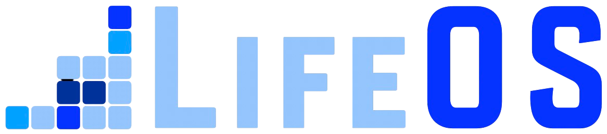

<p align="center">
  
</p>

<div align="center">


# LifeOS

**The Life Operating System**

[](Releases/v6.0.0/)
[](Releases/v6.0.0/README.md)
[](https://github.com/danielmiessler/LifeOS/stargazers)
[](./LICENSE)

**[Watch the walkthrough](https://youtu.be/Le0DLrn7ta0)**  ·  **[Releases](Releases/)**  ·  **[Docs](https://docs.ourlifeos.ai)**

</div>

---

LifeOS is a Life Operating System. It captures who you are, what you care about, and where you're trying to go, then uses AI that knows you to help you get there. Everything runs on one loop: move from your current state to your ideal state through steps you can verify.

## Install

**Give it to your AI.** Paste this into Claude Code (or any AI coding harness) and say **"install this"** — your AI does the whole setup for you.

```bash
curl -fsSL https://ourlifeos.ai/install.sh | bash
```

Prefer the terminal? Run the same command yourself. You'll need [Claude Code](https://docs.claude.com/claude-code) and [bun](https://bun.sh).

## Core Components

**The unique features** — the parts you won't find anywhere else.

<table>
<tr>
<td width="20%" valign="top" align="center">

### 🎯
**Current → Ideal State**

Name where you are and where you want to be, then close the gap with checkable steps.

</td>
<td width="20%" valign="top" align="center">

### 🧭
**TELOS**

Your mission, goals, and challenges — the file the system reasons against.

</td>
<td width="20%" valign="top" align="center">

### ⚙️
**The Algorithm**

A seven-phase engine that turns a vague ask into a testable spec and climbs toward it.

</td>
<td width="20%" valign="top" align="center">

### 📋
**The ISA**

The Ideal State Artifact — one document capturing what "done" is, as verifiable criteria.

</td>
<td width="20%" valign="top" align="center">

### 🧩
**The Skill System**

100+ self-activating, composable units of expertise.

</td>
</tr>
<tr>
<td width="20%" valign="top" align="center">

### 🪝
**The Hook System**

Guardrails that are code, not good intentions, enforced every session.

</td>
<td width="20%" valign="top" align="center">

### 🔀
**The Router System**

Every prompt routed to the right effort and model, automatically.

</td>
<td width="20%" valign="top" align="center">

### 📊
**Pulse**

The Life Dashboard — where you watch the whole system run.

</td>
<td width="20%" valign="top" align="center">

### ✨
**Custom Spinner Verbs**

Your own animated working-verb and tips in the statusline.

</td>
<td width="20%" valign="top" align="center">

### 💬
**Custom Tooltips**

The dashboard explains itself on hover, no manual needed.

</td>
</tr>
</table>

**The supporting components** — the subsystems underneath.

<table>
<tr>
<td width="20%" valign="top" align="center"><b>🧠 Memory</b><br/><sub>Compounds across sessions.</sub></td>
<td width="20%" valign="top" align="center"><b>🤖 Agents</b><br/><sub>Parallel delegation to specialists.</sub></td>
<td width="20%" valign="top" align="center"><b>🔊 Voice</b><br/><sub>Spoken notifications in your voice.</sub></td>
<td width="20%" valign="top" align="center"><b>🎓 Learning</b><br/><sub>Every run feeds the next.</sub></td>
<td width="20%" valign="top" align="center"><b>🛡️ Security</b><br/><sub>Keeps private data private.</sub></td>
</tr>
</table>

---

## 🧩 Skills

LifeOS installs as one self-contained skill that bundles the whole library — research, security, writing, art, and more. Browse them all on the site.

**[Browse all skills →](https://ourlifeos.ai/skills)**

---

## ❓ FAQ

### How is LifeOS different from just using Claude Code?

LifeOS is built natively on Claude Code and designed to stay that way. We chose Claude Code because its hook system, context management, and agentic architecture are the best foundation available for personal AI infrastructure.

LifeOS isn't a replacement for Claude Code — it's the layer on top that makes Claude Code *yours*:

- **Persistent memory** — Your DA remembers past sessions, decisions, and learnings
- **Custom skills** — Specialized capabilities for the things you do most
- **Your context** — Goals, contacts, preferences—all available without re-explaining
- **Intelligent routing** — Say "research this" and the right workflow triggers automatically
- **Self-improvement** — The system modifies itself based on what it learns

Think of it this way: Claude Code is the engine. LifeOS is everything else that makes it *your* car.

### What's the difference between LifeOS and Claude Code's built-in features?

Claude Code provides powerful primitives — hooks, slash commands, MCP servers, context files. These are individual building blocks.

LifeOS is the complete system built on those primitives. It connects everything together: your goals inform your skills, your skills generate memory, your memory improves future responses. LifeOS turns Claude Code's building blocks into a coherent personal AI platform.

### Is LifeOS only for Claude Code?

LifeOS is Claude Code native. We believe Claude Code's hook system, context management, and agentic capabilities make it the best platform for personal AI infrastructure, and LifeOS is designed to take full advantage of those features.

That said, LifeOS's concepts (skills, memory, algorithms) are universal, and the code is TypeScript and Bash — so community members are welcome to adapt it for other platforms.

### How is this different from fabric?

[Fabric](https://github.com/danielmiessler/fabric) is a collection of AI prompts (patterns) for specific tasks. It's focused on *what to ask AI*.

LifeOS is infrastructure for *how your DA operates*—memory, skills, routing, context, self-improvement. They're complementary. Many LifeOS users integrate Fabric patterns into their skills.

### What if I break something?

Recovery is straightforward:

- **Back up first** — Before any upgrade: `cp -r ~/.claude ~/.claude-backup-$(date +%Y%m%d)`
- **USER/ is safe** — Your customizations in `USER/` are never touched by the installer or upgrades
- **Settings merge, not overwrite** — The installer only updates identity and version fields; your hooks, statusline, and custom config are preserved
- **Git-backed** — Version control everything, roll back when needed
- **History is preserved** — Your DA's memory survives mistakes
- **DA can fix it** — Your DA helped build it, it can help repair it
- **Re-install** — Run the installer again; it detects existing installations and merges intelligently

---

## 🎯 Roadmap

| Feature | Description |
|---------|-------------|
| **Local Model Support** | Run LifeOS with local models (Ollama, llama.cpp) for privacy and cost control |
| **Granular Model Routing** | Route different tasks to different models based on complexity |
| **Remote Access** | Access your LifeOS from anywhere—mobile, web, other devices |
| **Outbound Phone Calling** | Voice capabilities for outbound calls |
| **External Notifications** | Robust notification system for Email, Discord, Telegram, Slack |

---

## 🌐 Community

**GitHub Discussions:** [Join the conversation](https://github.com/danielmiessler/LifeOS/discussions)

**Community Discord:** LifeOS is discussed in the [community Discord](https://danielmiessler.com/upgrade) along with other AI projects

**Twitter/X:** [@danielmiessler](https://twitter.com/danielmiessler)

**Blog:** [danielmiessler.com](https://danielmiessler.com)

### Star History

<a href="https://star-history.com/#danielmiessler/LifeOS&Date">
 <picture>
   <source media="(prefers-color-scheme: dark)" srcset="https://api.star-history.com/svg?repos=danielmiessler/LifeOS&type=Date&theme=dark" />
   <source media="(prefers-color-scheme: light)" srcset="https://api.star-history.com/svg?repos=danielmiessler/LifeOS&type=Date" />
   
 </picture>
</a>

---

## 🤝 Contributing

We welcome contributions! See our [GitHub Issues](https://github.com/danielmiessler/LifeOS/issues) for open tasks.

1. **Fork the repository**
2. **Make your changes** — Bug fixes, new skills, documentation improvements
3. **Test thoroughly** — Install in a fresh system to verify
4. **Submit a PR** with examples and testing evidence

---

## 📜 License

MIT License - see [LICENSE](LICENSE) for details.

---

## 🙏 Credits

**Anthropic and the Claude Code team** — First and foremost. You are moving AI further and faster than anyone right now. Claude Code is the foundation that makes all of this possible.

**[IndyDevDan](https://www.youtube.com/@indydevdan)** — For great videos on meta-prompting and custom agents that have inspired parts of LifeOS.

### Contributors

**[fayerman-source](https://github.com/fayerman-source)** — Google Cloud TTS provider integration and Linux audio support for the voice system.

**Matt Espinoza** — Extensive testing, ideas, and feedback, plus roadmap contributions.

---

## 💜 Support This Project

<div align="center">

<a href="https://github.com/sponsors/danielmiessler"></a>

**LifeOS is free and open-source forever. If you find it valuable, you can [sponsor the project](https://github.com/sponsors/danielmiessler).**

</div>

---

## 📚 Related Reading

- [The Real Internet of Things](https://danielmiessler.com/blog/the-real-internet-of-things) — The vision behind LifeOS
- [AI's Predictable Path: 7 Components](https://danielmiessler.com/blog/ai-predictable-path-7-components-2024) — Visual walkthrough of where AI is heading
- [Building a Personal AI Infrastructure](https://danielmiessler.com/blog/personal-ai-infrastructure) — Full walkthrough with examples

---

<details>
<summary><strong>📜 Update History</strong></summary>

<br/>

**v6.0.0 (2026-07-02) — One Skill, One Install**
- **Skill-based distribution** — the whole system now ships as a single self-contained skill (`LifeOS/`): the orchestrator (SKILL.md + Workflows + Tools) plus a complete install payload (system prompt, Algorithm, 49 skills, hooks, agents, Pulse, statusline, USER + MEMORY scaffolds). One directory, one install.
- **First release under the LifeOS name** — the project was PAI (Personal AI Infrastructure); this is the same system, renamed.
- **One-line install** — `curl -fsSL https://ourlifeos.ai/install.sh | bash` lays down the entire system.
- **Full Pulse on first boot** — the installer stands up the Life Dashboard and menu-bar app, ships generic TELOS templates so the dashboard renders on a fresh install, and runs the setup interview to seed it.
- **Algorithm v6.23.0** — Current State → Ideal State across seven phases, classifier-driven mode + tier, cross-vendor verification at E4/E5.
- **Clean by construction** — nothing personal ships; the USER tree is a blank template you populate. Release gates + a cross-vendor audit run before every publish.
- [Full release notes](Releases/v6.0.0/README.md)

**v5.0.0 (2026-04-30) — Life Operating System**
- **Pulse** — unified daemon (port 31337): voice, hooks, observability, cron, Life Dashboard, wiki API, optional Telegram/iMessage bridges. Replaces every previous loose service.
- **The DA** — Digital Assistant identity layer. PRINCIPAL_IDENTITY + DA_IDENTITY pair, loaded at session start. `/interview` walks you through naming your DA, picking a voice, capturing TELOS.
- **Algorithm v6.3.0** — seven-phase loop (OBSERVE → THINK → PLAN → BUILD → EXECUTE → VERIFY → LEARN). Classifier picks MINIMAL/NATIVE/ALGORITHM and tier (E1–E5) per prompt. Verification doctrine (live-probe, advisor calls, cross-vendor audit at E4/E5).
- **The ISA** — Ideal State Artifact primitive. One document, twelve sections, five identities. Owned by the **ISA skill**.
- **Containment + release tooling** — privacy is structural. Security gates run on every public release; two-stage release (stage → publish) never auto-chains.
- **Memory v7.6** — structured by purpose: WORK, KNOWLEDGE (typed graph), LEARNING, RELATIONSHIP, OBSERVABILITY, STATE.
- [Full release notes + migration guide](Releases/v5.0.0/README.md)

**v4.0.3 (2026-03-01) — Community PR Patch**
- JSON array parsing fix in Inference.ts, 29 dead references removed, portability fixes, user context migration
- [Release Notes](Releases/v4.0.3/README.md)

**v4.0.0 (2026-02-27) — Lean and Mean**
- 38 flat skill directories → 12 hierarchical categories, dead systems removed, CLAUDE.md template system, comprehensive security sanitization
- [Release Notes](Releases/v4.0.0/README.md)

**v3.0.0 (2026-02-15) — The Algorithm Matures**
- Algorithm v1.4.0, persistent PRDs and parallel loop execution, full installer with GUI wizard, agent teams/swarm, voice personality system
- [Release Notes](Releases/v3.0/README.md)

**v2.4.0 (2026-01-23) — The Algorithm**
- Universal problem-solving system with ISC tracking, Euphoric Surprise as the outcome metric
- [Release Notes](Releases/v2.4/README.md)

**v2.0.0 (2025-12-28) — v2 Launch**
- Modular architecture with independent skills, Claude Code native design

</details>

---

<div align="center">

**Built with ❤️ by [Daniel Miessler](https://danielmiessler.com) and the LifeOS community**

*Augment yourself.*

</div>
